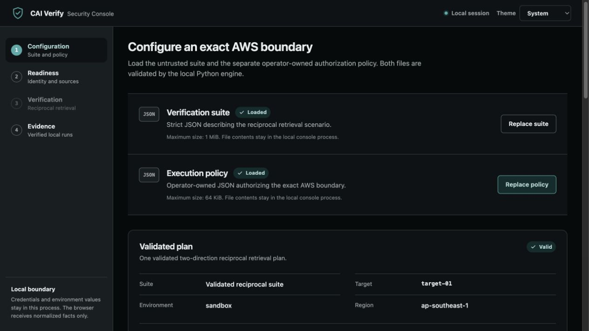
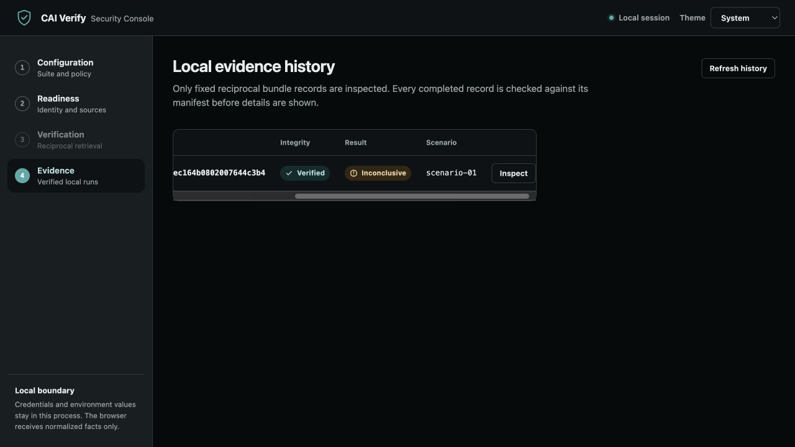

# CAI Verify

**Focused, fail-closed security verification for AWS retrieval applications.**

CAI Verify executes two synthetic retrieval requests from distinct AWS
identities, correlates each action with application-reported evidence, evaluates
the reciprocal boundary, and preserves a manifest-verified local evidence
bundle. It is built for platform and security engineers who want a repeatable
runtime test—not another cloud configuration dashboard.

The first release is intentionally narrow: one reciprocal retrieval workflow,
one local security console, and no claim of universal tenant isolation or
regulatory compliance.

> **Engineering alpha**
>
> The full automated gate is passing with synthetic clients and loopback-only
> local tests. The protected manual AWS release gate still needs a final
> isolated/vulnerable rerun after bounded CloudWatch visibility polling was
> added, so this repository does not yet claim publicly validated AWS operation.



_Sensitive identifiers are masked by default. The console can temporarily
reveal only a fixed allowlist of configuration fields; it never reveals
credentials, canary values, correlations, or environment values._

## What it verifies

For one pre-instrumented AWS retrieval application, CAI Verify checks two
requester directions:

1. requester A should retrieve its own synthetic baseline marker without
   retrieving requester B's marker;
1. requester B should retrieve its own synthetic baseline marker without
   retrieving requester A's marker.

Each direction uses:

- one declared non-mutating AWS SigV4 application action;
- one distinct least-privilege requester identity;
- one shared, separate read-only evidence identity;
- one exact transient correlation identifier;
- one fixed pre-generation retrieval event from CloudWatch Logs; and
- one deterministic `retrievalBoundary` evaluation.

Both directions must pass for the aggregate result to pass. A missing,
uncorrelated, stale, malformed, partial, or ambiguous event never becomes a
pass.

This is a focused technical test of two declared synthetic paths. It does not
prove every tenant, document, query, cache, memory path, or application
instrumentation decision.

## Why it exists

Cloud dashboards can show configuration and activity, but they do not
necessarily answer a narrower runtime question:

> Did these two identities receive only their intended retrieval context during
> this exact application run?

CAI Verify turns that question into a bounded, repeatable workflow with explicit
authorization, exact correlation, conservative result semantics, and portable
local evidence.

## Supported scope

| Capability                                          | Status                                    |
| --------------------------------------------------- | ----------------------------------------- |
| Reciprocal AWS retrieval-boundary verification      | Supported end to end                      |
| Local loopback security console                     | Supported for the reciprocal workflow     |
| Manifest-verified local evidence history            | Supported                                 |
| Offline evidence-integrity verification             | Supported                                 |
| Single-chain AWS retrieval runner                   | Available as a diagnostic path            |
| Local synthetic secure/vulnerable demonstration     | Available                                 |
| Bedrock invocation and CloudTrail audit probes      | Built, not composed into a generic runner |
| Generic AWS suite orchestration                     | Not included                              |
| Encryption or unauthorized-identity evaluation      | Not included                              |
| Compliance mappings or certification decisions      | Not included                              |
| Evidence signing or third-party authenticity        | Not included                              |
| Remote console, authentication service, or database | Not included                              |

The strict contracts are committed as the
[verification-suite schema](schemas/verification-suite-1alpha1.schema.json) and
[AWS execution-policy schema](schemas/aws-execution-policy-1alpha1.schema.json).

## Quick local demonstration

The local example uses synthetic data and a standard-library loopback server.
It does not contact AWS, an external model, or the internet.

Requirements:

- Python 3.14;
- [uv](https://docs.astral.sh/uv/) 0.11.19 or a compatible 0.11 release; and
- GNU Make for development checks.

Install the locked environment:

```console
uv sync --all-extras --dev
```

Run the secure synthetic case:

```console
uv run cai-verify run-local examples/local/synthetic-suite.json \
  --mode secure \
  --run-id local-secure \
  --evidence-root .cai-verify/runs
```

The secure case exits `0`. Run the deliberately vulnerable case:

```console
uv run cai-verify run-local examples/local/synthetic-suite.json \
  --mode vulnerable \
  --run-id local-vulnerable \
  --evidence-root .cai-verify/runs
```

The vulnerable case is expected to exit `1` because the synthetic
canary-absence assertion fails.

Verify either finalized bundle without target or network access:

```console
uv run cai-verify verify-evidence \
  .cai-verify/runs/local-secure \
  --report json
```

A valid manifest proves that the stored bytes remain internally consistent. It
does not authenticate who created the unsigned bundle.

## Local security console

Launch the committed, packaged console from the repository environment:

```console
uv run cai-verify ui --evidence-root .cai-verify/runs
```

The server binds only to `127.0.0.1` and chooses an ephemeral port by default.
For automation or manual URL handling, disable automatic browser launch:

```console
uv run cai-verify ui \
  --evidence-root .cai-verify/runs \
  --no-open
```

The console guides one fixed workflow:

1. load a strict suite and separate operator-owned execution policy;
1. inspect the masked two-direction plan;
1. run AWS identity and evidence-source readiness checks;
1. explicitly confirm one reciprocal execution;
1. inspect normalized direction and aggregate results; and
1. review manifest-verified local evidence history.

Configuration, readiness, reveal state, and the active job stay in bounded
process memory. There is no browser storage, analytics, service worker, remote
asset, database, or supported remote API.

Only allowlisted configuration fields can be temporarily revealed. Reveals are
held in component memory and concealed after 30 seconds, navigation, tab loss,
or explicit concealment. Environment values are never revealable.

## Running against AWS

Use an isolated, non-production AWS account with synthetic markers only. CAI
Verify expects an existing pre-instrumented application, two requester roles,
one evidence-reader role, two pre-seeded documents, and an exact operator-owned
execution policy.

The repository includes:

- an [AWS workflow guide](examples/aws/README.md);
- a strict example
  [suite](examples/aws/reciprocal-retrieval-suite.json);
- a matching example
  [execution policy](examples/aws/reciprocal-retrieval-policy.json); and
- a [disposable reference target](examples/aws/reference_target/README.md) for
  first-run evaluation.

The reference target uses API Gateway, Lambda, DynamoDB, CloudWatch Logs, and
IAM. It deliberately does not use Bedrock, a model, a vector database, or
generated text. In `isolated` mode the expected result is `PASS/PASS`; in the
deliberately `vulnerable` mode it is `FAIL/FAIL`.

After preparing the exact suite, policy, identities, canaries, and standard AWS
SDK credential environment, check readiness:

```console
uv run cai-verify doctor retrieval suite.json \
  --execution-policy execution-policy.json
```

Then execute the reciprocal scenario:

```console
uv run cai-verify run-aws-reciprocal-retrieval suite.json \
  --scenario-id reciprocal-requester-retrieval \
  --execution-policy execution-policy.json \
  --run-id synthetic-reciprocal-001 \
  --evidence-root .cai-verify/runs
```

The verifier uses Boto3/Botocore in process. It never invokes the AWS CLI. The
source-only disposable-target manager uses the AWS CLI separately for guarded
fixture deployment and teardown.

## Result semantics

| Aggregate condition                       | Status         | Exit |
| ----------------------------------------- | -------------- | ---: |
| Both directions pass                      | `PASS`         |  `0` |
| Either direction fails                    | `FAIL`         |  `1` |
| Error without a fail                      | `ERROR`        |  `2` |
| Incomplete evidence without fail or error | `INCONCLUSIVE` |  `3` |

A `FAIL` means bounded evidence established a declared boundary contradiction.
`INCONCLUSIVE` means the system could not safely establish the required fact.
Operational validation, authorization, identity, persistence, or integrity
failures exit `2` with redacted diagnostics.

No status is a compliance determination.



_This historical run is intentionally shown as inconclusive: its bundle passed
integrity verification while CloudWatch evidence was not yet query-visible.
That result prompted bounded evidence-only polling; the action itself is never
repeated. Bundle integrity and assertion outcome remain separate facts._

## Evidence model

A completed reciprocal run stores only fixed, bounded artifacts:

- normalized action and probe facts for both directions;
- both assertion results;
- canonical JSON and terminal reports;
- run metadata; and
- a SHA-256 manifest created last.

Raw application bodies, CloudWatch messages, prompts, responses, documents,
canaries, correlations, account IDs, role or principal identifiers,
credentials, environment values, and SDK exception text are excluded.

Finalized runs are immutable through the writer and verified immediately.
Interrupted or failed operational runs may remain intentionally unfinalized
without a manifest; they are never resumed, adopted, or reported as complete.

Manifest verification detects missing, modified, unexpected, or unsafe
artifacts. Because bundles are not signed, someone able to replace the entire
bundle could create a different internally consistent bundle.

## Security boundary

The suite is untrusted and cannot authorize itself. A separate strict execution
policy must independently permit the exact account, partition, region,
endpoint, method, path, service, roles, and CloudWatch log group before AWS
access.

Additional boundaries include:

- scoped identities that cannot expose retained sessions or credentials;
- exact account, partition, role, region, and source validation;
- bounded SDK timeouts, retries, pages, event counts, bytes, and total runtime;
- no wildcard endpoints, arbitrary expressions, JSONPath, or query language;
- exact action-to-evidence correlation;
- evidence-only polling for delayed CloudWatch visibility without repeating the
  application action;
- fail-closed handling of stale, future, malformed, partial, oversized, or
  ambiguous evidence; and
- redacted public reports and UI payloads.

The console adds a one-use bootstrap token, host-only HttpOnly session cookie,
strict same-site behavior, exact Host and Origin checks, CSRF protection, a
restrictive content-security policy, and no configurable network binding.

## Limitations and release status

Application retrieval evidence is self-reported. A compromised or incorrectly
instrumented target can emit false telemetry, and the reported
`PRE_GENERATION` phase is not cryptographically proven.

The project currently has no generic AWS runner, evidence signatures, managed
remote service, user accounts, database, compliance mappings, or production
deployment automation.

Automated tests use synthetic clients with socket access disabled. Before this
alpha is described as publicly validated, a protected manual run must still
record:

- isolated `PASS/PASS`;
- deliberately vulnerable `FAIL/FAIL`;
- real bounded CloudWatch propagation;
- successful offline bundle verification; and
- confirmed reference-stack teardown.

## Development

Node 22.12 or newer is needed only when changing the React frontend. Operators
using packaged assets do not need Node.

```console
make sync
make check
make audit
```

`make check` runs Python linting, strict type checks, socket-disabled tests,
Markdown checks, frontend formatting, type checks and tests, the production UI
build, and source/wheel distribution validation. `make audit` checks the locked
Python and npm dependency graphs.

## License

Licensed under the [Apache License 2.0](LICENSE).
